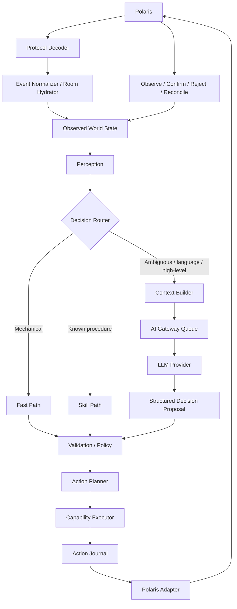

# Polaris ↔ AURA ↔ LLM Flow

This document defines the target flow. The LLM path is future work; Foundation must support the loop without requiring an LLM.

## Inbound rules

1. Raw packets are decoded and normalized before domain/runtime modules see them.
2. Entering a room requires hydration barriers; events that depend on user identity/room context may be buffered until core room state is ready.
3. World State is a projection of confirmed observations, not what AURA hoped would happen.
4. High-frequency state events may be coalesced; ordered social/transaction events must preserve order.
5. Each resident later receives a filtered perception rather than the complete world dump.

## Decision paths

- **Fast Path** — ping/pong, reconnect mechanics, movement progress and obvious deterministic reactions.
- **Skill Path** — a validated reusable procedure can execute without repeatedly consulting an LLM.
- **Cognitive Path** — only when interpretation, dialogue, ambiguous social choice or high-level planning is required.

## LLM boundary

Future LLMs may use read-only contextual tools such as memory search or relationship lookup. They return **proposals**, not privileged execution. Structured output is validated before any capability runs.

## Outbound rules

1. Decision proposals are validated against current state/policy/capabilities.
2. High-level actions may expand into deterministic capability steps.
3. Only the Capability Executor may request game actions through the Game/Polaris adapter.
4. Packet send = `PENDING`, never `SUCCESS`.
5. Polaris observations move actions to confirmed/rejected/reconciled states.
6. Ambiguous side effects (purchase/trade/etc.) must reconcile before retrying.
7. Future decisions should carry world/context revisions so stale decisions can be revalidated or discarded.
