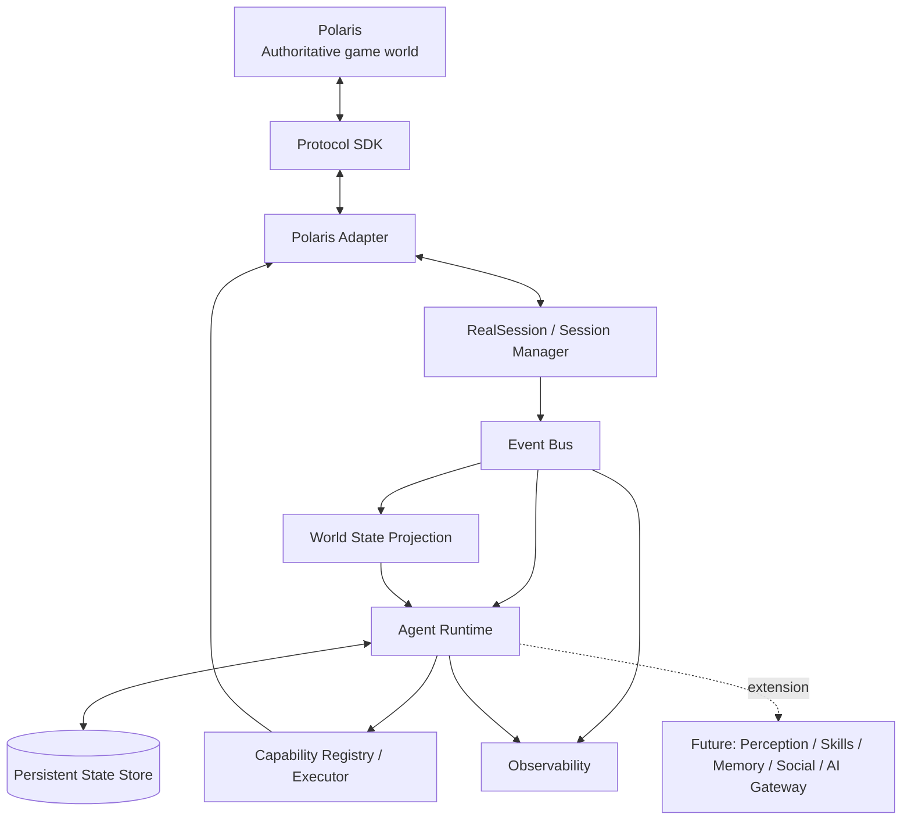

# AURA Architecture Overview

**Status:** accepted foundation direction.

AURA starts as a **modular monolith** using **Ports & Adapters** and an internal event-driven flow.

## Initial module boundaries

- `domain` — stable domain types, IDs, ports and invariants; no infrastructure dependencies.
- `protocol` — wire framing, packet encoding/decoding and protocol contracts; no agent behavior.
- `polaris` — adapter translating semantic AURA requests/events to/from Polaris protocol.
- `runtime` — sessions, event routing, world projection, agent lifecycle and capability orchestration.
- `persistence` — durable stores/migrations/checkpoints behind ports.
- `observability` — structured logs/traces/diagnostics.

We intentionally start with few packages. Split further only when ownership/complexity justifies it.

## Explicitly out of Foundation core

- Ollama/LLM provider.
- long-term memory implementation.
- social engine.
- economy/room planning.
- full event sourcing.
- microservices/Kafka/Redis/Temporal/LangGraph.
